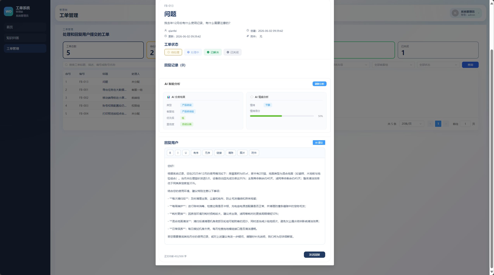

# 智能工单 Agent 系统

这是一个用于学习和面试展示的智能工单 Agent 项目，不是生产级系统。项目在传统工单系统的基础上接入 AI 服务，用来展示工单分类、LangGraph 回复建议工作流、知识库问答、RAG、工具调用、历史案例记忆和 Agent 评测等能力。

## 亮点

- 不是单纯调用大模型，而是把 Agent 接入了完整工单处理流程
- 回复建议使用 LangGraph 编排：历史案例检索、qwen3-32b 语义路由、分支处理、生成、自检、一次重写和安全降级
- USER_RECORD 分支保留局部 ReAct，能按需组合时间、当前用户记录和 RAG 工具
- 知识问答使用 HyDE、BM25 + 向量混合检索、qwen3-rerank 和来源返回
- 同时结合用户记录、知识库 RAG、历史案例记忆和工具调用
- 有本地可复现评测，也能用 LangSmith 展示实验对比

## 展示


## 项目定位

本项目面向客服工单场景，核心流程包括：

- 用户提交反馈或工单
- Java 后端管理工单、用户、回复、状态流转
- Python AI 服务负责分类、情绪/优先级分析、RAG 问答和回复建议
- Vue 前端提供用户反馈页、管理员工单页、知识问答页和知识库管理页
- 本地评测与 LangSmith 评测用于观察 Agent 改动前后的效果变化

整体架构可以理解为：

```text
Vue 前端
  -> Java Spring Boot 业务服务
      -> MySQL
      -> Python FastAPI AI 服务
          -> 大模型 / Embedding / Rerank
          -> Milvus Lite 本地向量库
          -> LangSmith 评测与观测
```

## 重要声明：非生产级项目

传统工单项目来自：
https://github.com/mxnican/workOrderFrontend
https://github.com/mxnican/workOrderBackend

本项目明确用于学习、课程/简历/面试展示，不建议直接用于真实生产环境。

当前仍保留了一些演示性质设计：

- 密码为明文存储，未做哈希加密
- Java 后端 session 存在内存中，服务重启后登录态会失效
- 公开注册页可以选择管理员角色
- Java 业务服务和 Python AI 服务之间没有服务鉴权
- 本地 Milvus Lite 适合个人开发和演示，不适合多人并发生产环境

如果要改造成生产系统，至少需要补充密码加密、JWT/Redis session、管理员注册审批、服务间鉴权、权限隔离、审计日志、限流、异常告警，以及正式的向量数据库部署方案。

## 核心能力

- 工单自动分类、优先级和用户情绪分析
- 按分类自动路由到客服组
- 管理员 AI 回复建议：LangGraph 条件边工作流、语义路由、分支处理、自检与一次重写
- 用户使用记录查询工具
- 知识库 RAG 问答
- 管理员上传、删除知识库文档
- RAG rerank 重排序
- 历史相似工单案例记忆
- 本地评测与 LangSmith 评测

## 运行前配置

项目至少需要配置百炼 API Key；LangSmith Key 只在运行评测或链路观测时需要：

- `DASHSCOPE_API_KEY`：必需，用于通义千问模型、Embedding、Rerank 等能力
- `LANGSMITH_API_KEY`：可选，用于 LangSmith 评测和链路观测

你可以选择配置到系统环境变量中，也可以在项目根目录新建 `.env` 文件。Python AI 服务会通过 `python-dotenv` 自动读取 `.env`。本地运行时，建议在仓库根目录启动命令，方便 `.env` 被正确读取。

示例：

```env
DASHSCOPE_API_KEY=your_dashscope_api_key
LANGSMITH_TRACING=true
LANGSMITH_ENDPOINT=https://api.smith.langchain.com
LANGSMITH_PROJECT=workorder-agent
# 如果需要运行 LangSmith 评测，再配置：
LANGSMITH_API_KEY=your_langsmith_api_key
```

公开发布到 GitHub 时，不要提交包含真实密钥的 `.env` 文件。

Python AI 服务还支持用环境变量覆盖容器或本地运行配置：

```env
AI_MYSQL_HOST=127.0.0.1
AI_MYSQL_PORT=3306
AI_MYSQL_USER=root
AI_MYSQL_PASSWORD=123456
AI_MYSQL_DATABASE=work_order
AI_FASTAPI_HOST=0.0.0.0
AI_FASTAPI_PORT=8003
AI_VECTOR_MILVUS_URI=data/milvus_lite.db
```

## 运行命令

以下命令默认在仓库根目录执行。

### 1. 准备数据库

先确认本地 MySQL 已启动，并存在 `work_order` 数据库。后端启动时会读取：

```text
workOrderBackend-main/src/main/resources/workorder-schema.sql
```

默认数据库配置在：

```text
workOrderBackend-main/src/main/resources/application.yml
```

如需覆盖数据库连接，可使用环境变量：

```bash
WORKORDER_DB_URL=jdbc:mysql://127.0.0.1:3306/work_order?useSSL=false&allowPublicKeyRetrieval=true&serverTimezone=Asia/Shanghai
WORKORDER_DB_USERNAME=root
WORKORDER_DB_PASSWORD=123456
```

### 2. 启动 Python AI 服务

推荐使用你的 Agent 环境：

```bash
D:\anaconda3\envs\Agent\python.exe -m workOrderAI.main
```

服务默认读取 `workOrderAI/config.yaml`，端口默认为 `8003`。

健康检查：

```bash
http://localhost:8003/health
```

### 3. 初始化知识库向量数据

如果切换了 Milvus Lite、清空了向量库，或新增了 `workOrderAI/data/` 下的知识资料，可以运行：

```bash
D:\anaconda3\envs\Agent\python.exe -m workOrderAI.utils.vector_store
```

该命令会读取 `workOrderAI/config.yaml` 中的 `vector_store.data_path`，把允许类型的知识文件写入本地 Milvus Lite。

### 4. 导入用户使用记录

如果需要把 `workOrderAI/data/external/records.csv` 导入 MySQL：

```bash
D:\anaconda3\envs\Agent\python.exe workOrderAI/import_user_records.py
```

脚本会创建并刷新 `user_records` 表。

### 5. 启动 Java 后端

进入后端目录：

```bash
cd workOrderBackend-main
mvn spring-boot:run
```

如果本机没有把 Maven 加入 PATH，也可以使用 IntelliJ 自带 Maven，例如：

```bash
"D:\IntelliJ IDEA\plugins\maven\lib\maven3\bin\mvn.cmd" spring-boot:run
```

后端默认端口为 `8080`。

### 6. 启动 Vue 前端

进入前端目录：

```bash
cd workOrderFrontend-main
npm install
npm run dev
```

Vite 会在终端中输出访问地址，通常是：

```text
http://localhost:5173
```

### 7. 运行评测

本地评测：

```bash
D:\anaconda3\envs\Agent\python.exe -m workOrderAI.evals.run --suite core --mode local
```

LangSmith 评测：

```bash
D:\anaconda3\envs\Agent\python.exe -m workOrderAI.evals.run --mode langsmith --experiment-prefix workorder-agent
```

本地报告 + LangSmith 同步：

```bash
D:\anaconda3\envs\Agent\python.exe -m workOrderAI.evals.run --mode both --experiment-prefix workorder-agent
```

## Docker 最小部署

项目提供了一版最小可运行的 Docker Compose 配置，包含：

```text
mysql       MySQL 数据库
ai-service  Python FastAPI AI 服务
backend     Spring Boot 业务后端
frontend    Vue 构建产物 + nginx
```

首次运行前，建议在仓库根目录创建 `.env`，至少配置百炼 API Key：

```env
DASHSCOPE_API_KEY=your_dashscope_api_key
LANGSMITH_TRACING=false
MYSQL_ROOT_PASSWORD=123456
```

启动：

```bash
docker compose up -d --build
```

查看日志：

```bash
docker compose logs -f ai-service
docker compose logs -f backend
docker compose logs -f frontend
docker compose logs -f mysql
```

访问：

```text
前端：http://localhost:5173
后端：http://localhost:8080
AI 服务：http://localhost:8003/health
MySQL：localhost:3307
```

导入用户使用记录：

```bash
docker compose exec ai-service python workOrderAI/import_user_records.py
```

初始化知识库向量数据：

```bash
docker compose exec ai-service python -m workOrderAI.utils.vector_store
```

停止：

```bash
docker compose down
```

如果要连 MySQL 数据卷一起删除：

```bash
docker compose down -v
```

注意：Docker 部署下后端和 AI 服务都通过服务名访问 MySQL，容器内不是 `localhost`。Milvus Lite 和知识库文件挂载在 `workOrderAI/data/`，删除该目录会丢失本地向量库和上传文档。

## 目录结构

```text
workOrderFrontend-main/   Vue 前端
workOrderBackend-main/    Java Spring Boot 业务后端
workOrderAI/              Python FastAPI AI 服务
workOrderAI/evals/        Agent 本地评测与 LangSmith 评测
```

## 技术栈

- 前端：Vue、Element Plus、Axios
- 后端：Spring Boot、JdbcTemplate、MySQL
- AI 服务：FastAPI、LangChain、LangGraph、DashScope、Milvus Lite
- Agent 能力：语义路由、工具调用、局部 ReAct、RAG、HyDE、Rerank、历史案例记忆、self-check
- 评测：本地 JSONL 数据集、规则评分、LLM Judge、LangSmith

## 评测说明

本项目包含一套用于面试展示的 Agent 评测体系，覆盖：

- 工单分类
- 回复建议
- 知识问答

本地运行示例：

```bash
python -m workOrderAI.evals.run --suite core --mode local
```

LangSmith 运行示例：

```bash
python -m workOrderAI.evals.run --mode langsmith --experiment-prefix workorder-agent
```

如果希望同时保留本地报告并同步 LangSmith：

```bash
python -m workOrderAI.evals.run --mode both --experiment-prefix workorder-agent
```


